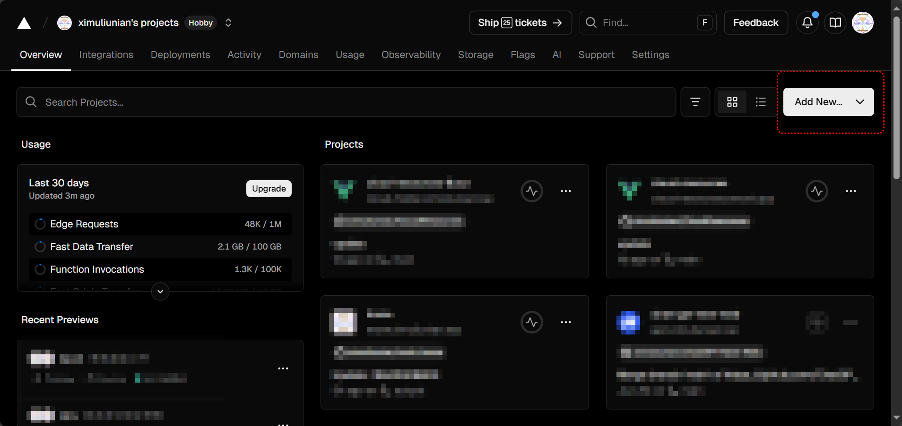
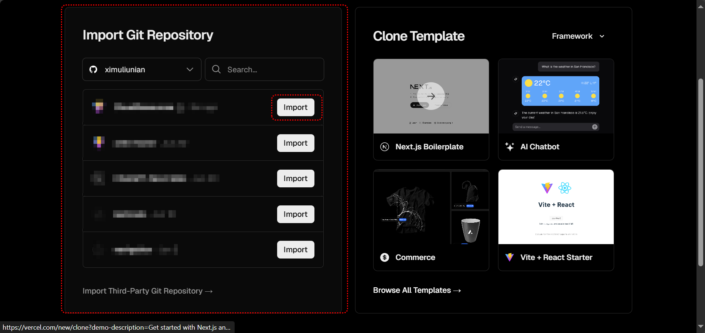
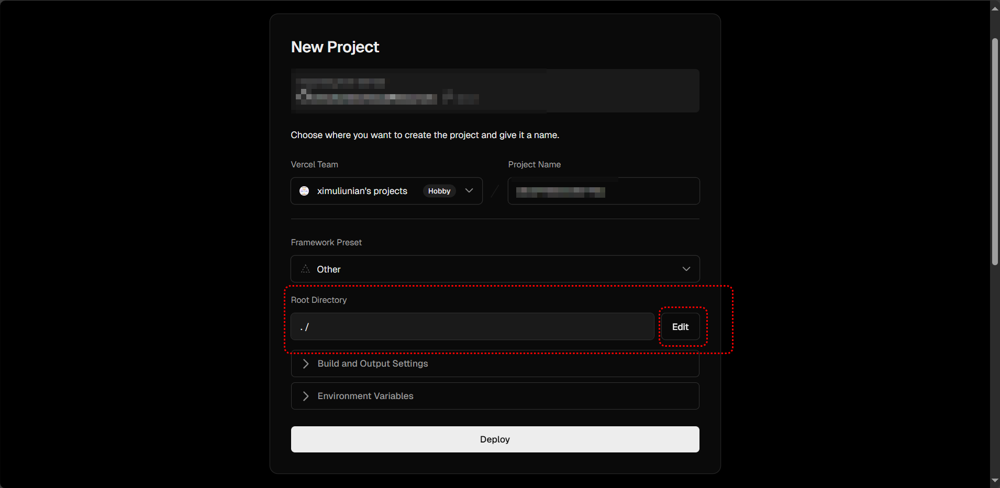
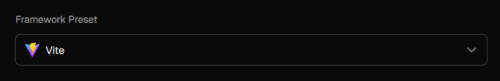
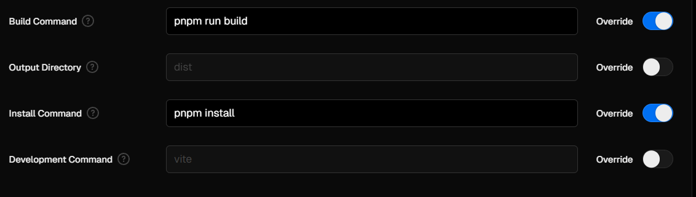

# Cloud Explorer

本项目是一个网络分享资源管理平台，旨在为用户提供一个方便的方式来管理各种网络分享资源。使用者可以像使用 Win 的资源管理器一样来使用本项目

主要技术栈：NodeJS + pnpm + Vue3 + Vite + TypeScript

## 如何使用

> 前置条件：需要安装 Git 环境

首先在本地创建一个目录（这里暂且叫它 root），然后在目录下执行以下命令

```bash
# 初始化项目
git init

# 拉取本项目为子模块
git submodule add https://github.com/ximuliunian/CloudExplorer.git CloudExplorer

# 初始化和更新子模块
git submodule update --init --recursive
```

> 如果本项目更新了，但是子模块是不会自己更新的，需要手动更新子模块
>
> ```bash
> # 更新子模块（尝试合并）
> git submodule update --remote --merge CloudExplorer
>
> # 如果你在子模块中有本地修改或提交，使用以上命令不会被丢弃，而是尝试自动合并
> # 如果合并失败，你可能需要手动解决冲突，如果不想或者不会解决冲突，你可以使用以下命令
> # 强制更新子模块（丢弃本地修改和提交）
> git submodule update --remote CloudExplorer
> ```
>
> 每次更新子模块之前需要先来本仓库中查看一下是否对配置做了更新，该怎么配置这些更新的内容。做好准备后再更新子模块

然后再根目录（root）中创建一个以下结构的目录和文件

```txt
root:
│  .env  # 环境变量文件
│  .gitignore    # Git 忽略文件
│
├─CloudExplorer  # 子模块目录
│      ......
│
├─public    # 静态资源目录
│  │  favicon.ico    # 网站图标（替换为自己的网站图标）
│  │
│  └─image  # 图片目录
│      └─background  # 背景图片目录
│              xxx.jpg  # 背景图片（多个）
│              index.json    # 背景图片索引文件
│
└─source    # 分享资源源目录
```

至此准备工作就完成了，接下来进行配置项目

### 配置项目（环境配置）

打开根目录（root）中的 .env 文件，添加以下内容

```bash
# 站点logo
VITE_FAVICON = "/favicon.ico"
# 站点标题
VITE_TITLE = ""
# 站点描述
VITE_DESCRIPTION = ""
# 站点关键字（每个使用英文逗号分割）
VITE_KEYWORDS = ""

# 秘笈
SECRET_KEY = ""
```

上面的配置项中以 `VITE_` 开头的配置项是 Vite 提供的配置项，用于配置项目的一些基本信息，按部就班的填写即可；`SECRET_KEY` 是一个密码，在 分享资源 的 JSON 中有一个名为 `is_secret` 的字段，如果这个字段的值为 `true` ，那么这个资源就不会直接的展示在首页中，只有在验证密码后才能展示和访问这个资源。

验证方式是在主页的搜索框中输入密码，然后点击搜索按钮进行验证。如果验证成功，那么就会访问隐藏资源，如果验证失败，则是什么都不会做。每次验证成功后都会有 三天 的缓存期，缓存期过后就需要重新验证密码。

### 配置项目（Git 忽略文件）

打开根目录（root）中的 .gitignore 文件，添加以下内容

```bash
/public/api
```

通过 `pnpm run dev` 命令启动项目后会在 public 目录下生成一个 api 目录，这个目录是用于存放请求 API 数据的，这个目录中的数据如果存在则会在打包时出现文件重复的问题，所以需要将这个目录添加到 Git 忽略文件中。

### 配置项目（静态资源）

打开根目录（root）中的 public/image/background 目录，将自己的背景图片复制到这个目录中，然后在这个目录中打开 index.json 文件，添加如下格式的 JSON 注册上背景图片

```json
[
    "/image/background/1.jpg",
    "/image/background/2.jpg",
    "/image/background/3.jpg",
    "/image/background/4.jpg",
    "/image/background/5.jpg",
]
```

以上只是一个示例，你可以根据自己的需要添加更多的背景图片，然后在 index.json 文件中注册上这些背景图片。前面的 `/image/background/` 是固定的，后面的 `1.jpg` 是你自己的背景图片的文件名。

### 配置项目（分享资源源目录）

打开根目录（root）中的 source 目录，将自己的 分享资源（JSON） 复制到这个目录中即可，项目会自动扫描这个目录中的所有 分享资源（JSON）。

source 中的文件夹最终也会作为一个目录展示在项目中，目录名称就是文件夹的名称。资源文件（JSON） 会以文件中的 `title` 字段作为资源的名称展示在项目中。

> 注意：资源文件（JSON） 中的 `title` 字段建议不要重复，否则会出现资源名称重复的情况
> 在你部署完成后或者本地启动本项目后可以通过 `[部署或本机地址]/add` （例如：`https://example.com/add`）的网址来进入添加资源的页面

### 免责声明

在 `public` 目录中创建一个名为 `disclaimer.md` 的文件，在这个文件中就可以书写对应的条款。如果没有这个文件，则不会弹出声明框

## Vercel 部署

> 不管通过什么部署，选项中项目的根目录一定要是拉取的 Git 的子模块
>
> 部署之前把内容代码上传到 GitHub

通过 GitHub 登录之后进入主页面



点击 Add New... >> Project



在以上位置选择对应的存储库，然后点击 `Import`，进入以下页面



之后找到红框框选的部分，这里就是决定项目根目录的。点击 `Edit` 选择对应的目录，然后上面的 `Framework Preset` 应该会自己变为 `Vite`

> 如果找不到对应的子模块文件夹，直接部署即可。到之后去部署项目的设置中手动填写子模块名称



如果没变则需要手动选择，然后选择下面的 `Build and Output Settings` ，按照下如填写



至此 Vercel 部署完成，其他的部署方式，比如 `Cloudflare Pages` 跟 Vercel 部署一样，都是需要设置一下根目录和构建方式